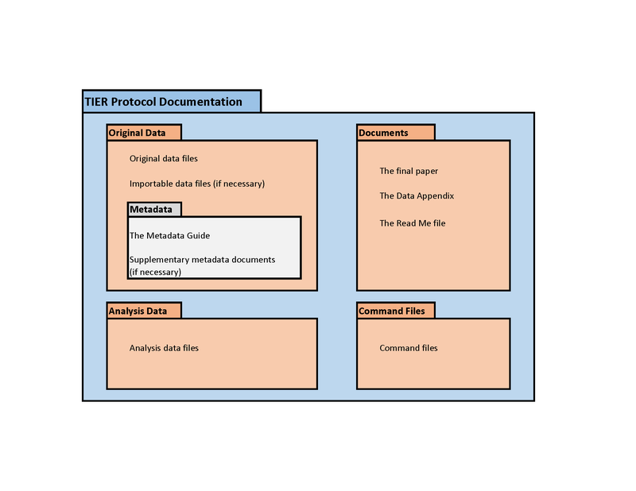

# Structure of the project

## Providing a bit more structure

- Starting to cumulate documents, code, etc.
- Let's structure the project by modern standards, i.e., **by function**

## Folder by function

Let's start with something easy. Separate folders for each function: `code/` and `data/`

```{.bash}
code/
data/
```

## TIER Protocol

- The [TIER Protocol](https://www.projecttier.org/tier-protocol/tier-protocol-version-history/specifications-3-0/#overview-of-the-documentation) is a set of guidelines for organizing reproducible research.




## Scripts by function

We will download -> Create a script `download_data.do`

## Paths in scripts

> 🛑Do not hard-code paths! 

```
copy "$URL" "C:\Users\lv39\Desktop\day1\data\dist_cepii.dta", replace
```

Why?

## Names in scripts

> 🛑Do not rename data files! 

```
copy "$URL" "C:\Users\lv39\Desktop\day1\data\that_file_from_cepii.dta", replace
```

Why?

## State {.smaller}

:::: {.columns}
::: {.column width="50%"}

- Code
- Data downloaded by code
- README
- Directories by function

:::
::: {.column width="50%"}

```{.bash}
Stage1
├── code
│   └── download_data.do
├── data
│   └── dist_cepii.dta
├── LICENSE
└── README.md
```

:::
::::


