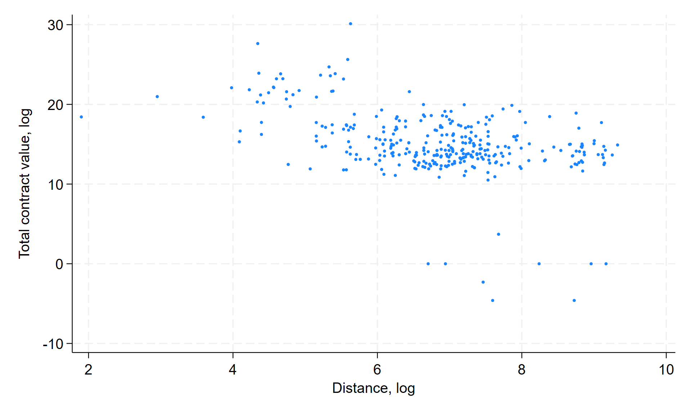

# Analysis

## Let's create a figure!



- <https://gist.github.com/larsvilhuber/aa8b0699c6f230774a8be14fafee6c60>
- Create `analysis.do` (where?)


## State {.smaller}

:::: {.columns}
::: {.column width="50%"}

- Code
- Data downloaded by code
- README
- Directories by function
- Lots of code[^fallback4]


:::
::: {.column width="50%"}

```{.bash}
Stage4
├── code
│   ├── analysis.do
│   ├── create_analysis_sample.do
│   └── download_data.do
├── data
│   ├── derived
│   │   ├── analysis.dta
│   │   └── country-codes.dta
│   └── raw
│       ├── country-codes.csv
│       ├── dist_cepii.dta
│       └── ted-sample.csv
├── figure
│   └── fig1.pdf
├── LICENSE
└── README.md
```
:::
::::

 
[^fallback4]: [🔒Tag: stage4](https://github.com/codedthinking/day1/tree/stage4) [🔒Diff: stage4](https://github.com/codedthinking/day1/commit/9c3a37a1220b2b6e217008c5b0e6ec962bbdb23b)

# Many steps later...

- Time to write a main file!

## Purpose of the main file

- Complete list of all steps!
- One-touch reproduction
- Robustness checks all along
- Maybe also some additional re-org

## Example

Main file:[^fallback5]


```
// main.do
do "code/00_setup.do"
do "code/01_download_data.do"
do "code/02_create_analysis_sample.do"
do "code/03_analysis.do"
```


## State {.smaller}

:::: {.columns}
::: {.column width="50%"}

```{.bash}
Stage5
├── code
│   ├── 00_setup.do
│   ├── 01_download_data.do
│   ├── 02_create_analysis_sample.do
│   ├── 03_analysis.do
│   └── main.do       <=================
├── data/
├── figure/
|
├── LICENSE
|
└── README.md
```
:::
::: {.column width="50%"}

```{.bash}
Stage5
├── code
│   ├── 00_setup.do
│   ├── 01_download_data.do
│   ├── 02_create_analysis_sample.do
│   └── 03_analysis.do
|
├── data/
├── figure/
|
├── LICENSE
├── main.do     <==============
└── README.md
```
:::
::::


[^fallback5]: [🔒Tag: stage5](https://github.com/codedthinking/day1/tree/stage5) [🔒Diff: stage5](https://github.com/codedthinking/day1/commit/30374c03e1846a3072d3393bc14c16aa3a27009b)

