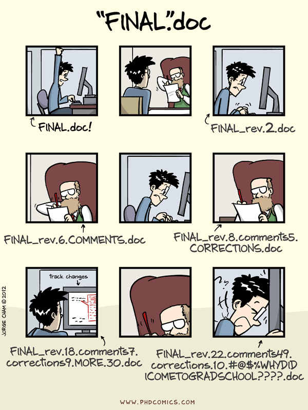
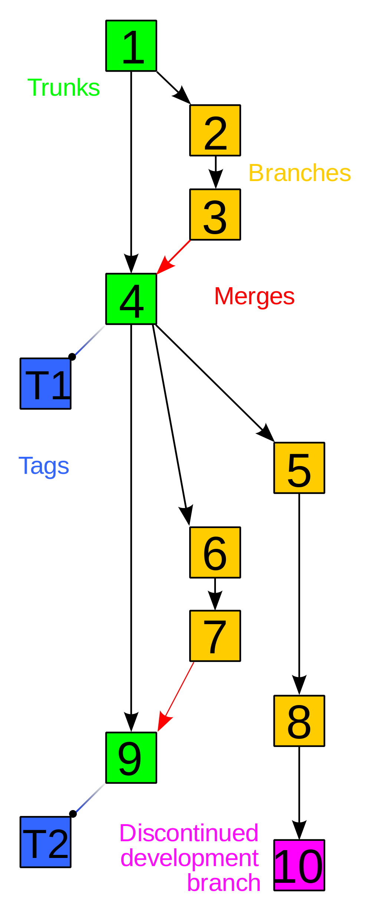
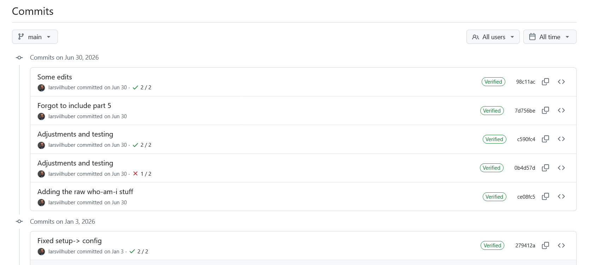
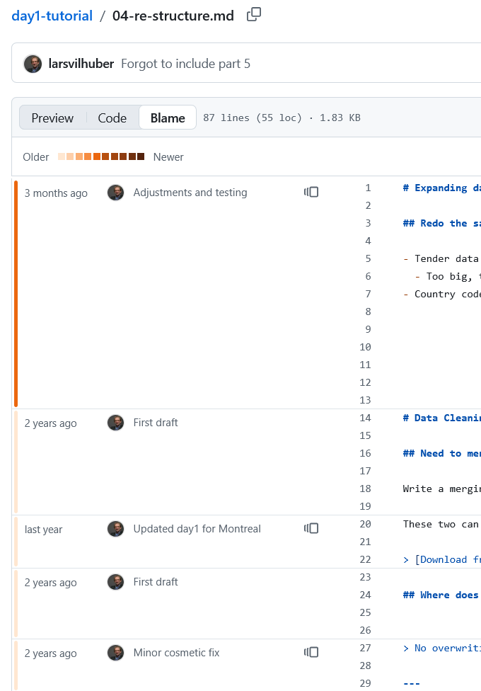

# Versioning

## Are you keeping track of all the changes?

## One way



## Another way: Git


## Who uses Git? {.orange}

## Who uses Github? {.orange}

## Who knows that those are not the same? {.orange}

## Git is not GitHub

- **Git**: the version control system — tracks changes, runs on your computer
  - but **GitHub** is really convenient
- **GitHub**: a website that hosts Git repositories (there are others: GitLab, Bitbucket, Codeberg...)

## What does Git do?

A version control system. Track the progress of a project:

- **what** changed?
- **who** made the change?

## Git and the command line

Not here: <https://swcarpentry.github.io/git-novice/>.

## Git is an example of a VCS

- **Version control systems (VCS)** or *Source Configuration Management (SCM)* systems  allow developers or authors to keep track of the history of their project's source code. ([source](http://better-scm.shlomifish.org/))

- **Generic view**: a mechanism to manage different versions (historical, parallel) of documents, files, programs, etc.

## You already have it

Implicit uses of version control:

- Backup systems (Apple Time Machine, others)
- Word processors (Undo, Track Changes in Word; finer-grained in Google Docs, blog software, etc.)
- Versioning filesystems
- Paper books!

## An example: textbook editions


## The principal idea

:::::{.columns}
:::: {.column width="50%"}


::::
:::: {.column width="50%"}

- First edition
- Second edition
- Start of work on a Canadian edition
- Start of work on the next US edition
- Third edition
- First Canadian edition
::::

## File-system based versioning 

The most common (informal) method... also used in email...

```
01_01_readBLS.R
02_01_readCensus.R
02_02_prepareCensus.R
03_01_create_analysis_data.R
04_01_runOLS.sas
README.txt
```

## What if I make changes? 

```{.bash code-line-numbers="7-10"}
01_01_readBLS.R
02_01_readCensus.R
02_02_prepareCensus.R
03_01_create_analysis_data.R
04_01_runOLS.sas
README.txt
02_01_readCensus.R.bak
02_01_readCensus_V2.R
02_01_readCensus_V3.R
02_01_readCensus_V3-jma.R
02_01_readCensus_V3-jma-rm.R
```

Sound familiar?

## Is there a better way? {.orange}

## Two major types of version control

**Centralized model**

- Server-client: editors check out a copy, modify it, check it back in
- *File locking*: only one person can check out a given file at a time
- *Version merging*: discrepancies are handled at check-in

**Distributed model**

- No central server required
- Every editor has a full copy of the history
- Synchronization happens by exchanging patches

## We'll focus on Git

- Subversion (centralized) — still around, but rarely the default choice today
- Git (decentralized) — the modern default
  - Windows: [Git for Windows](https://gitforwindows.org/) or [TortoiseGit](http://tortoisegit.org/) (free)
  - macOS: installed with Xcode on first use
  - Linux: typically pre-installed
- Various graphical clients exist too (GitHub Desktop, GitKraken, etc.)


## Tracking history

One of the key advantages of using a VCS: **the ability to control versions**.

- Straightforward to view multiple versions of a file (assuming proper usage)
- Possibility to view who changed what (`blame` / `annotate`)

## Tracking with a web interface



## Tracking with a web interface



## What if you don't want to use Git? {.orange}

Don't do this:

```bash
02_01_readCensus.R.bak
02_01_readCensus_V2.R
02_01_readCensus_V3.R
02_01_readCensus_V3-jma.R
02_01_readCensus_V3-jma-rm.R
```

## Simple robust versioning

**Rather, do this**

```bash
02_01_readCensus.R
02_01_readCensus.2003-09-22-lv.R
02_01_readCensus.2004-04-11-jma.R
02_01_readCensus.2009-03-07-jma.R
02_01_readCensus.2021-01-03-jma-rm.R
```


## Simple robust versioning

**Or do this**


```bash
...
02_01_readCensus.R
backup/
   codes.2003-09-22-lv.zip
   codes.2004-04-11-jma.zip
   codes.2009-03-07-jma.zip
   codes.2021-01-03-jma-rm.zip
backup.sh
```

## Whatever you do

- document how you want to version (in the README!)
- script it (automate it if possible)
- make a **habit** out of it


## Quick video 

<https://www.youtube.com/watch?v=UC13HZ7hpOg>

(with Jeremy Freese, Julian Reif, and David Wasser)