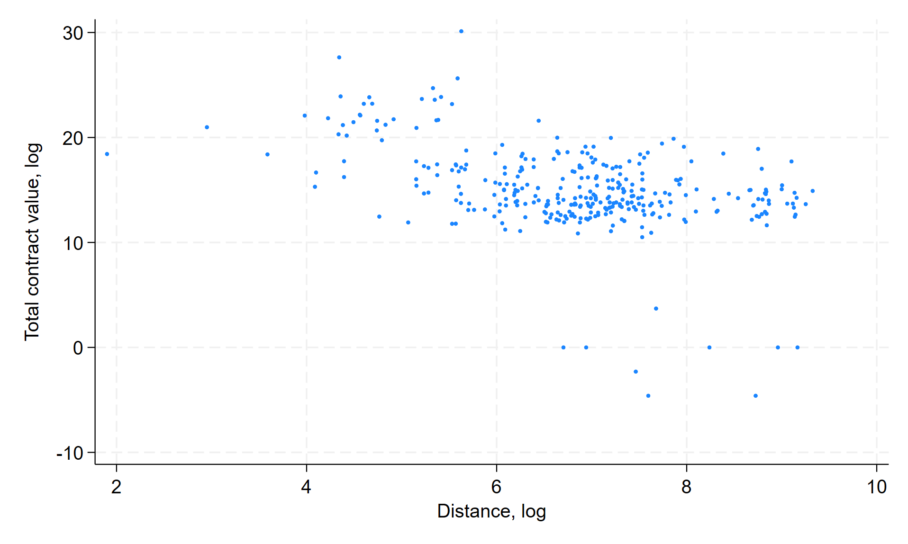

# Reproducibility from Day 1

Journals require that you **share your code and data** in a replication package at the end of your research project. 

Following some best practices from day 1 can not only **help you prepare** this package later, but also make you **more productive** researchers. 

## What is a replication package?

- [AEA Data and Code Availability policy](https://www.aeaweb.org/journals/data/data-code-policy)
- [Data and Code Availability Standard](https://datacodestandard.org/)  
- [AEA Data and Code Repository](https://www.openicpsr.org/openicpsr/search/aea/studies)

## Example of deposit


## AEA policy


## Goal

- [ ] Illustrate principles of reproducible research from the start
- [ ] Stay reasonably close to an ideal reproducibility Standard
- [ ] Use tools that are widely available and easy to use

## Scenario

We start with an empty folder, and an idea.

:::: {.columns}

::: {.column width="50%"}


:::
::: {.column width="50%"}

**Does procurement in the EU have a bias towards local providers?**

:::
::::

We finish with a mini-project about public procurement across various European countries. 

```{r, child=c(here::here('01-setup.md'))}	
```

```{r, child=c(here::here('02-provenance.md'))}
```

```{r, child=c(here::here('03-structure.md'))}
```

```{r, child=c(here::here('04-re-structure.md'))} 
```

# 

```{r, child=c(here::here('99-links.md'))}